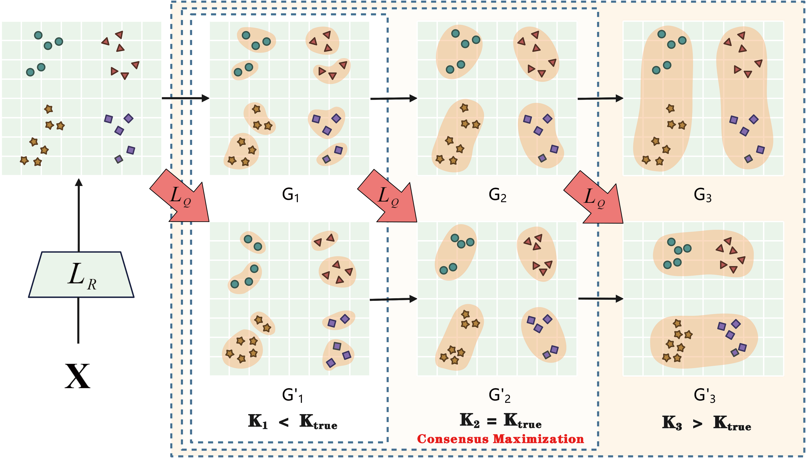

# 2026-AAAI-SCMax

The code for "Parameter-Free Clustering via Self-Supervised Consensus Maximization" (AAAI’26 Oral)



## Run SCMax

```python
Python demo.py
```

Python==3.8

PyTorch==1.10.0

CUDA==11.3 

## Citation

```
@inproceedings{zhang2026parameter,
  title={Parameter-Free Clustering via Self-Supervised Consensus Maximization},
  author={Zhang, Lijun and Liu, Suyuan and Wang, Siwei and Yu, Shengju and Zhu, Xueling and Li, Miaomiao and Liu, Xinwang},
  booktitle={Proceedings of the AAAI Conference on Artificial Intelligence},
  volume={40},
  number={33},
  pages={28310--28318},
  year={2026}
}
```
